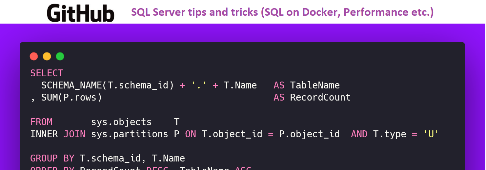

# SQL Server tips and tricks

 
# Context

This project contains a lot of Microsoft SQL Server tips and tricks useful for programmers and DBA.

# Index

- Setup a SQL Server on Docker (linux version) with timezone, password
- Restoring Databases throught sqlcmd (command line) from outside your container
- [Discovering all tables of database and respective rows count](sql-table-rows-count.md)   
- Transaction Isolation Levels (NOLOCK, READ UNCOMMITED, READ COMMITED etc.)

# About the Author and license
- **Erick** is a Senior Backend Developer and Architect. 
- You can reach **Erick** by email <seixaserick77@gmail.com> or Linkedin <https://www.linkedin.com/in/seixaserick/>
- Other Github Repositories: <https://github.com/seixaserick/> 
- MIT License (please check [LICENSE.txt](LICENSE.txt) for more details)

 