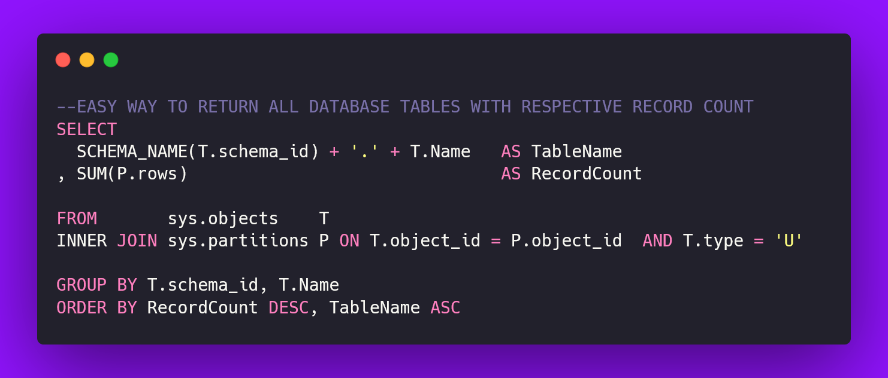

# Discovering all tables of database and respective rows count


 
# Context

Sometimes we need to optimize quickly the dabase or watch how tables are growing.

This is a quick way to list all tables os a such database and sort them by rows count.

# Query

```
SELECT
 SCHEMA_NAME(T.schema_id) + '.' + T.Name    AS TableName 
, SUM(P.rows)                               AS RecordCount 
FROM        sys.objects    AS T 
INNER JOIN  sys.partitions AS P
      ON T.object_id = P.object_id AND T.type = 'U' 
GROUP BY T.schema_id     , T.Name 
ORDER BY RecordCount DESC, TableName ASC
```


# About the Author and license
- **Erick** is a Senior Backend Developer and Architect. 
- More [SQL tips and tricks](README.md)
- Other [Github projects](https://github.com/seixaserick/)
- MIT License (please check [LICENSE.txt](LICENSE.txt) for more details)

 